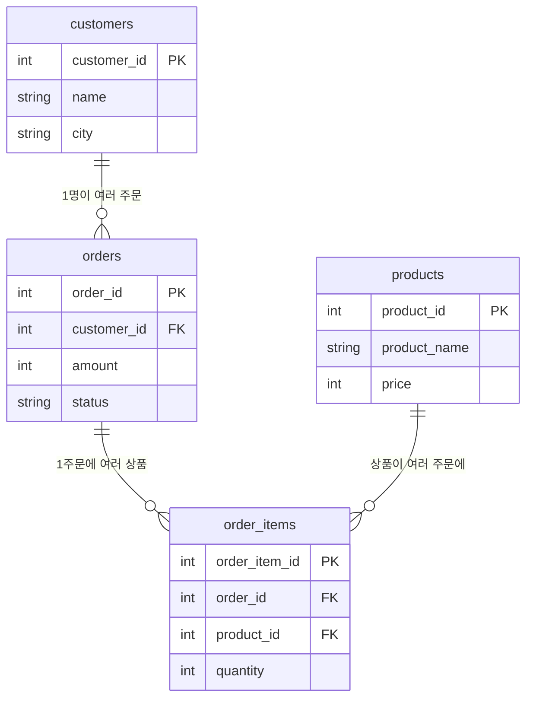
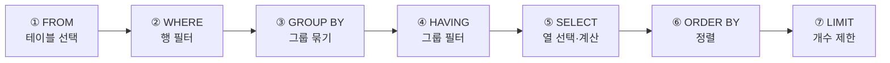
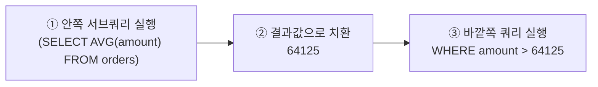

# DB 쿼리 5일 완성 학습 (Day 1 ~ Day 5)

> **이 문서의 목표**: SQL을 처음부터 5일에 걸쳐 초급 → 중급 → 고급으로 쌓아 올린다.
> 매일 `초급 / 중급 / 고급` 세 단계로 나뉘며, 모든 예제는 **아래 하나의 샘플 DB**로 실습한다.
>
> - **DBMS 기준**: 표준 SQL 위주. **MySQL 8.0+ / PostgreSQL 12+** 에서 그대로 동작.
>   Oracle·SQL Server에서 다른 부분은 `📌 DBMS 차이`로 표시.
> - **학습법**: 예제를 눈으로만 읽지 말 것. **결과 예측 → 실행 → 비교**가 핵심.
>   각 단계 끝의 연습문제는 접힌 정답을 보기 전에 스스로 먼저 풀어보기.

## 📚 커리큘럼 한눈에 보기

| Day | 주제 | 초급 | 중급 | 고급 |
|-----|------|------|------|------|
| **1** | 데이터 조회 첫걸음 | `SELECT`·`WHERE` | `AND/OR`·`BETWEEN`·`IN`·`LIKE` | `ORDER BY`·`LIMIT`·`DISTINCT`·`NULL` |
| **2** | 함수와 데이터 가공 | 산술연산·별칭·`CONCAT` | 문자열·숫자 함수 | 날짜 함수·`CASE`·`COALESCE` |
| **3** | 집계와 그룹화 | 집계 함수 5종 | `GROUP BY` | `HAVING`·`WHERE` vs `HAVING` |
| **4** | 여러 테이블(JOIN) | `INNER JOIN` | `LEFT/RIGHT JOIN`·3중 조인 | `SELF JOIN`·`UNION`·조인+집계 |
| **5** | 서브쿼리·윈도우 함수 | 서브쿼리 기초 | 상관·인라인뷰·`EXISTS`·`CTE` | 윈도우 함수·재귀 CTE |

---

## 0. 실습용 샘플 스키마 (전 Day 공통)

모든 예제는 아래 4개 테이블(전자상거래 미니 DB)을 사용합니다.

```sql
-- 고객
CREATE TABLE customers (
    customer_id   INT PRIMARY KEY,
    name          VARCHAR(50),
    city          VARCHAR(50),
    signup_date   DATE
);

-- 주문 (한 건의 주문 = 한 행)
CREATE TABLE orders (
    order_id      INT PRIMARY KEY,
    customer_id   INT,
    order_date    DATE,
    amount        INT,          -- 주문 총액(원)
    status        VARCHAR(20)   -- 'PAID', 'CANCELLED', 'REFUNDED'
);

-- 상품
CREATE TABLE products (
    product_id    INT PRIMARY KEY,
    product_name  VARCHAR(50),
    category      VARCHAR(30),
    price         INT
);

-- 주문 상세 (주문 1건에 상품 여러 개)
CREATE TABLE order_items (
    order_item_id INT PRIMARY KEY,
    order_id      INT,
    product_id    INT,
    quantity      INT
);
```

### 🗺️ 테이블 관계도 (ER 다이어그램)

한 명의 고객은 여러 주문을 하고, 한 주문은 여러 상품을 담습니다. 아래 관계를 머릿속에 그려두면 JOIN이 쉬워집니다.



> 읽는 법: `||--o{` 는 "왼쪽 1개 ↔ 오른쪽 여러 개(1:N)" 관계. `PK`=기본키, `FK`=외래키(다른 테이블을 가리키는 열).

### 샘플 데이터 (복사해서 바로 실습)

```sql
INSERT INTO customers VALUES
(1, '김서준', '서울', '2025-01-05'),
(2, '이하은', '부산', '2025-02-11'),
(3, '박도윤', '서울', '2025-03-20'),
(4, '최지우', '대구', '2025-05-02'),
(5, '정유나', '부산', '2025-06-15');

INSERT INTO orders VALUES
(101, 1, '2025-06-01', 45000,  'PAID'),
(102, 1, '2025-06-18', 12000,  'PAID'),
(103, 2, '2025-06-03', 89000,  'PAID'),
(104, 2, '2025-07-01', 30000,  'CANCELLED'),
(105, 3, '2025-06-25', 150000, 'PAID'),
(106, 3, '2025-07-05', 22000,  'REFUNDED'),
(107, 4, '2025-07-08', 67000,  'PAID'),
(108, 1, '2025-07-10', 98000,  'PAID');
-- 고객 5(정유나)는 아직 주문 없음

INSERT INTO products VALUES
(10, '무선마우스',  '전자', 25000),
(11, '기계식키보드','전자', 89000),
(12, '텀블러',     '생활', 18000),
(13, '노트북거치대','생활', 32000);

INSERT INTO order_items VALUES
(1001, 101, 10, 1),
(1002, 101, 12, 1),
(1003, 103, 11, 1),
(1004, 105, 11, 1),
(1005, 105, 13, 2),
(1006, 108, 10, 2),
(1007, 108, 13, 1);
```

---

# 📅 Day 1 — 데이터 조회의 첫걸음 (SELECT · WHERE · ORDER BY)

> **핵심 한 줄**: SQL 조회의 뼈대는 `SELECT 컬럼 FROM 테이블 WHERE 조건 ORDER BY 정렬`.

### 🧩 SELECT 문장 해부도

각 절이 "무엇을" 담당하는지 위치로 기억하세요.

```text
   무엇을 볼까?          어디서?           어떤 조건으로?         어떻게 정렬?
   ┌───────────┐    ┌───────────┐    ┌──────────────┐    ┌──────────────┐
   SELECT name,city  FROM customers   WHERE city='서울'    ORDER BY name;
   └────┬──────┘    └─────┬─────┘    └──────┬───────┘    └──────┬───────┘
      보여줄 열         대상 테이블        행을 걸러내는 조건        결과 정렬 기준
```

## 🟢 초급 — SELECT와 WHERE 기본

### 예시 1 — 전체 / 특정 컬럼 조회
```sql
SELECT * FROM customers;                    -- 모든 컬럼(*)
SELECT name, city FROM customers;           -- 원하는 컬럼만
```
- 실무에서는 `*`보다 **필요한 컬럼만** 명시하는 습관이 좋습니다(성능·가독성).

### 예시 2 — WHERE로 조건 걸기
```sql
SELECT name, city
FROM customers
WHERE city = '서울';                         -- 문자열은 작은따옴표
```
```sql
SELECT order_id, amount
FROM orders
WHERE amount >= 50000;                       -- 숫자는 따옴표 없이
```
- 비교 연산자: `=`, `<>`(같지 않다), `>`, `<`, `>=`, `<=`.

### ✍️ 초급 연습
1. `products`에서 `category`가 '전자'인 상품의 이름과 가격을 조회하라.

<details><summary>정답</summary>

```sql
SELECT product_name, price FROM products WHERE category = '전자';
```
</details>

## 🟡 중급 — 여러 조건 조합하기

### 예시 1 — AND / OR / NOT
```sql
SELECT * FROM orders
WHERE status = 'PAID' AND amount >= 50000;    -- 둘 다 만족

SELECT * FROM customers
WHERE city = '서울' OR city = '부산';           -- 둘 중 하나
```
- ⚠️ `AND`가 `OR`보다 먼저 계산됨. 헷갈리면 **괄호로 우선순위**를 명시:
  `WHERE (a OR b) AND c`.

### 예시 2 — BETWEEN / IN
```sql
SELECT * FROM orders
WHERE amount BETWEEN 30000 AND 100000;         -- 30000 이상 100000 이하(양끝 포함)

SELECT * FROM customers
WHERE city IN ('서울', '부산');                  -- OR을 깔끔하게
```

### 예시 3 — LIKE (부분 문자열 검색)
```sql
SELECT * FROM products WHERE product_name LIKE '%키보드%';  -- '키보드' 포함
SELECT * FROM customers WHERE name LIKE '김%';              -- '김'으로 시작
```
- `%` = 아무 문자 0개 이상, `_` = 아무 문자 딱 1개.

### ✍️ 중급 연습
1. 주문 금액이 20,000~90,000원 사이인 주문을 조회하라.
2. 이름이 '박'으로 시작하는 고객을 조회하라.

<details><summary>정답</summary>

```sql
SELECT * FROM orders WHERE amount BETWEEN 20000 AND 90000;
SELECT * FROM customers WHERE name LIKE '박%';
```
</details>

## 🔴 고급 — 정렬 · 개수 제한 · 중복 제거 · NULL

### 예시 1 — ORDER BY (다중 정렬)
```sql
SELECT name, city, signup_date
FROM customers
ORDER BY city ASC, signup_date DESC;    -- 도시 오름차순 → 같은 도시는 가입일 내림차순
```
- `ASC`(오름차순, 기본값), `DESC`(내림차순).

### 예시 2 — LIMIT / OFFSET (상위 N개, 페이징)
```sql
SELECT order_id, amount
FROM orders
ORDER BY amount DESC
LIMIT 3;                 -- 금액 상위 3건

SELECT * FROM orders ORDER BY order_id LIMIT 3 OFFSET 3;  -- 4~6번째(페이징)
```
- 📌 **DBMS 차이**: SQL Server는 `TOP 3` 또는 `OFFSET ... FETCH`, Oracle은 `FETCH FIRST 3 ROWS ONLY`.

### 예시 3 — DISTINCT (중복 제거)
```sql
SELECT DISTINCT city FROM customers;   -- 도시 목록(중복 없이)
```

### 예시 4 — NULL 처리
```sql
SELECT * FROM orders WHERE status IS NULL;      -- NULL은 = 이 아니라 IS NULL
SELECT * FROM orders WHERE status IS NOT NULL;
```
- ⚠️ **`= NULL`은 항상 거짓**. 반드시 `IS NULL` / `IS NOT NULL` 사용.

### ✍️ 고급 연습
1. 주문을 금액 높은 순으로 정렬해 상위 2건만 조회하라.
2. 고객이 사는 도시 종류를 중복 없이 조회하라.

<details><summary>정답</summary>

```sql
SELECT * FROM orders ORDER BY amount DESC LIMIT 2;
SELECT DISTINCT city FROM customers;
```
</details>

---

# 📅 Day 2 — 함수와 데이터 가공

> **핵심 한 줄**: 저장된 값을 그대로 보는 데서 나아가, **함수로 가공·계산**해 원하는 형태로 뽑는다.

## 🟢 초급 — 산술 연산과 별칭(AS)

### 예시 1 — 계산된 컬럼 + 별칭
```sql
SELECT
    product_name,
    price,
    price * 1.1 AS price_with_vat     -- 부가세 10% 붙인 값, AS로 이름 부여
FROM products;
```
- `AS`로 결과 컬럼에 별칭을 주면 결과가 읽기 쉬워짐(`AS`는 생략 가능).

### 예시 2 — 문자열 결합
```sql
SELECT CONCAT(name, '(', city, ')') AS label FROM customers;  -- 김서준(서울)
```
- 📌 **DBMS 차이**: Oracle·PostgreSQL은 `name || '(' || city || ')'` (`||` 연결)도 가능.

### ✍️ 초급 연습
1. 주문 금액에서 배송비 3,000원을 뺀 값을 `net_amount`라는 이름으로 조회하라.

<details><summary>정답</summary>

```sql
SELECT order_id, amount, amount - 3000 AS net_amount FROM orders;
```
</details>

## 🟡 중급 — 문자열 · 숫자 함수

### 예시 1 — 문자열 함수
```sql
SELECT
    UPPER('sql'),            -- 'SQL' (대문자)
    LOWER('SQL'),            -- 'sql'
    LENGTH(name),            -- 글자 수
    SUBSTRING(name, 1, 1),   -- 이름 첫 글자 (성)
    REPLACE(city, '서울', 'Seoul'),
    TRIM('  공백  ')          -- 앞뒤 공백 제거
FROM customers;
```

### 예시 2 — 숫자 함수
```sql
SELECT
    ROUND(12345.678, 0),     -- 12346 (반올림)
    CEIL(12.1),              -- 13 (올림)
    FLOOR(12.9),             -- 12 (내림)
    ABS(-500),               -- 500 (절댓값)
    MOD(10, 3);              -- 1 (나머지)
```

### ✍️ 중급 연습
1. 고객 이름의 첫 글자(성)와 글자 수를 함께 조회하라.

<details><summary>정답</summary>

```sql
SELECT name, SUBSTRING(name, 1, 1) AS surname, LENGTH(name) AS len
FROM customers;
```
</details>

## 🔴 고급 — 날짜 함수 · CASE · NULL 함수

### 예시 1 — 날짜 다루기
```sql
SELECT
    CURRENT_DATE,                              -- 오늘 날짜
    order_date,
    YEAR(order_date)  AS y,                    -- 연
    MONTH(order_date) AS m                     -- 월
FROM orders;
```
- 📌 **DBMS 차이**: PostgreSQL은 `EXTRACT(YEAR FROM order_date)`, 날짜 차이는
  MySQL `DATEDIFF(a, b)`, PostgreSQL `a - b`.

### 예시 2 — CASE WHEN (조건별 값 만들기)
```sql
SELECT
    order_id,
    amount,
    CASE
        WHEN amount >= 100000 THEN 'VIP'
        WHEN amount >= 50000  THEN '일반'
        ELSE '소액'
    END AS grade
FROM orders;
```
- if-else처럼 조건에 따라 다른 값을 반환. 위에서부터 처음 맞는 조건 채택.

### 예시 3 — COALESCE / NULLIF
```sql
SELECT order_id, COALESCE(status, '미정') AS status  -- NULL이면 '미정'으로 대체
FROM orders;
```
- `COALESCE(a, b)`: a가 NULL이면 b. `NULLIF(a, b)`: a와 b가 같으면 NULL.

### ✍️ 고급 연습
1. 주문을 금액에 따라 'VIP'(10만↑)/'일반'/'소액'(5만↓)으로 분류해 조회하라.

<details><summary>정답</summary>

```sql
SELECT order_id, amount,
    CASE WHEN amount >= 100000 THEN 'VIP'
         WHEN amount >= 50000  THEN '일반'
         ELSE '소액' END AS grade
FROM orders;
```
</details>

---

# 📅 Day 3 — 집계와 그룹화 (GROUP BY)

> **핵심 한 줄**: 여러 행을 **하나로 요약**하는 것이 집계. "무엇을 기준으로 묶을지"가 `GROUP BY`.

### 📊 GROUP BY가 하는 일 (도식)

같은 값끼리 바구니에 담고, 바구니마다 집계 함수를 적용해 **한 줄로** 요약합니다.

```text
원본 행(orders)                 GROUP BY customer_id             결과
┌────┬────────┬───────┐        ┌──────────────────┐         ┌────┬───────┬────────┐
│ 1  │ 45000  │ ...   │  ┐     │  고객1 바구니     │         │고객│ 건수  │ 합계   │
│ 1  │ 12000  │ ...   │  ├──▶  │  45000,12000,98000│  SUM──▶ │ 1  │  3    │ 155000 │
│ 1  │ 98000  │ ...   │  ┘     └──────────────────┘         ├────┼───────┼────────┤
│ 2  │ 89000  │ ...   │  ┐     ┌──────────────────┐         │ 2  │  2    │ 119000 │
│ 2  │ 30000  │ ...   │  ├──▶  │  고객2 바구니     │  SUM──▶ ├────┼───────┼────────┤
│ 3  │150000  │ ...   │  ─┐    │  89000,30000      │         │ 3  │  2    │ 172000 │
│ 3  │ 22000  │ ...   │  ─┴─▶  └──────────────────┘         └────┴───────┴────────┘
└────┴────────┴───────┘        (여러 행 → 그룹 1개당 결과 1행)
```

## 🟢 초급 — 집계 함수 5종

### 예시 1 — 전체 요약
```sql
SELECT
    COUNT(*)    AS 주문건수,
    SUM(amount) AS 총매출,
    AVG(amount) AS 평균금액,
    MAX(amount) AS 최고금액,
    MIN(amount) AS 최저금액
FROM orders;
```
- `COUNT(*)`는 행 수, `COUNT(컬럼)`은 **NULL이 아닌** 값의 수.

### ✍️ 초급 연습
1. status가 'PAID'인 주문의 건수와 총매출을 구하라.

<details><summary>정답</summary>

```sql
SELECT COUNT(*) AS cnt, SUM(amount) AS total
FROM orders WHERE status = 'PAID';
```
</details>

## 🟡 중급 — GROUP BY로 묶어서 집계

### 예시 1 — 고객별 집계
```sql
SELECT
    customer_id,
    COUNT(*)    AS 주문수,
    SUM(amount) AS 총결제액
FROM orders
GROUP BY customer_id;                 -- customer_id가 같은 행끼리 묶음
```
- ⚠️ **규칙**: `SELECT`에 오는 컬럼은 집계 함수이거나 `GROUP BY`에 있어야 함.

### 예시 2 — 여러 컬럼으로 그룹
```sql
SELECT city, COUNT(*) AS 고객수
FROM customers
GROUP BY city;                        -- 도시별 고객 수
```

### ✍️ 중급 연습
1. 주문 상태(status)별 주문 건수를 구하라.

<details><summary>정답</summary>

```sql
SELECT status, COUNT(*) AS cnt FROM orders GROUP BY status;
```
</details>

## 🔴 고급 — HAVING (집계 결과 필터링)

### 예시 1 — HAVING
```sql
SELECT customer_id, SUM(amount) AS 총결제액
FROM orders
WHERE status = 'PAID'                 -- ① 개별 행 필터(집계 전)
GROUP BY customer_id
HAVING SUM(amount) >= 100000;         -- ② 집계 결과 필터(집계 후)
```

### 예시 2 — WHERE vs HAVING (가장 헷갈리는 부분!)
| 구분 | 시점 | 조건 대상 |
|------|------|-----------|
| `WHERE` | 그룹으로 묶기 **전** | 개별 행 (집계 함수 불가) |
| `HAVING` | 그룹으로 묶은 **후** | 집계 결과 (`SUM`, `COUNT` 등 가능) |

- 실행 순서: `FROM → WHERE → GROUP BY → HAVING → SELECT → ORDER BY`.

### ⚙️ 쿼리 실행 순서 (작성 순서 ≠ 실행 순서!)

우리는 `SELECT`부터 쓰지만, DB는 아래 순서로 처리합니다. 이 순서를 알면 `WHERE`/`HAVING`이 왜 다른지 이해됩니다.



> `WHERE`(②)는 그룹 만들기 **전**이라 집계 함수를 못 쓰고, `HAVING`(④)은 그룹 만든 **후**라 `SUM()` 같은 집계를 쓸 수 있습니다.

### ✍️ 고급 연습
1. 주문이 2건 이상인 고객의 `customer_id`와 주문 수를 구하라.

<details><summary>정답</summary>

```sql
SELECT customer_id, COUNT(*) AS cnt
FROM orders
GROUP BY customer_id
HAVING COUNT(*) >= 2;
```
</details>

---

# 📅 Day 4 — 여러 테이블 다루기 (JOIN)

> **핵심 한 줄**: 흩어진 테이블을 **공통 키**로 연결해 하나의 결과로 합치는 것이 JOIN.

### 🔗 JOIN 종류 한눈에 (벤 다이어그램)

두 테이블을 A(왼쪽), B(오른쪽)라 할 때, 어떤 부분을 결과에 남기느냐의 차이입니다. `██`=결과에 포함.

```text
   INNER JOIN              LEFT JOIN               RIGHT JOIN
   교집합만                 A 전부 + 겹치는 B         B 전부 + 겹치는 A
      ___  ___                ___  ___                 ___  ___
     /   \/   \              /██ \/   \               /   \/ ██\
    | A  ██ B  |            |██A ██ B  |             | A  ██ B██|
    |    ██    |            |██  ██    |             |    ██  ██|
     \___/\___/              \██_/\___/               \___/\_██/
   양쪽 다 있는 행만        왼쪽은 무조건 나옴        오른쪽은 무조건 나옴
   (짝 없으면 제외)        (짝 없으면 오른쪽 NULL)   (짝 없으면 왼쪽 NULL)
```

> 예: `customers LEFT JOIN orders` → 주문 없는 정유나도 **결과에 나오고** 주문 열은 `NULL`.
> 그래서 "주문 안 한 고객 찾기"는 `LEFT JOIN ... WHERE order_id IS NULL` 패턴을 씁니다.

## 🟢 초급 — INNER JOIN

### 예시 1 — 두 테이블 연결
"주문 정보에 **고객 이름**을 붙여라"
```sql
SELECT
    o.order_id,
    c.name,
    o.amount
FROM orders o
INNER JOIN customers c ON o.customer_id = c.customer_id;   -- 연결 조건
```
- `o`, `c`는 **테이블 별칭**(길게 안 쓰려고). `ON`에 연결 기준을 씀.
- `INNER JOIN`은 **양쪽에 다 있는** 행만 결과에 나옴(주문 없는 정유나는 제외).

### ✍️ 초급 연습
1. 주문 상세(`order_items`)에 상품명(`products.product_name`)을 붙여 조회하라.

<details><summary>정답</summary>

```sql
SELECT oi.order_id, p.product_name, oi.quantity
FROM order_items oi
INNER JOIN products p ON oi.product_id = p.product_id;
```
</details>

## 🟡 중급 — LEFT JOIN과 3중 조인

### 예시 1 — LEFT JOIN (한쪽 다 살리기)
"**모든 고객**을 나열하되, 주문이 있으면 주문도 함께 (주문 없어도 고객은 나옴)"
```sql
SELECT c.name, o.order_id, o.amount
FROM customers c
LEFT JOIN orders o ON c.customer_id = o.customer_id;
```
- 왼쪽(`customers`) 행은 **모두** 유지. 짝이 없으면 오른쪽 컬럼은 `NULL`.
- 정유나는 `order_id`가 `NULL`로 나옴 → "주문 없는 고객 찾기"에 활용.
- `RIGHT JOIN`은 반대(오른쪽 다 살림).

### 예시 2 — 세 테이블 연결
"주문 → 주문상세 → 상품"을 한 번에
```sql
SELECT c.name, o.order_id, p.product_name, oi.quantity
FROM orders o
JOIN customers   c  ON o.customer_id = c.customer_id
JOIN order_items oi ON o.order_id    = oi.order_id
JOIN products    p  ON oi.product_id = p.product_id;
```
- JOIN을 이어 붙이면 3개, 4개 테이블도 연결 가능.

### ✍️ 중급 연습
1. 주문이 없는 고객의 이름을 조회하라. (`LEFT JOIN` + `IS NULL`)

<details><summary>정답</summary>

```sql
SELECT c.name
FROM customers c
LEFT JOIN orders o ON c.customer_id = o.customer_id
WHERE o.order_id IS NULL;                 -- 짝이 없는 = 주문 없는 고객
```
</details>

## 🔴 고급 — SELF JOIN · UNION · JOIN + 집계

### 예시 1 — JOIN + 집계 (가장 실무적)
"**도시별 총 결제금액**을 구하라"
```sql
SELECT
    c.city,
    SUM(o.amount) AS 도시매출
FROM customers c
JOIN orders o ON c.customer_id = o.customer_id
WHERE o.status = 'PAID'
GROUP BY c.city
ORDER BY 도시매출 DESC;
```
- JOIN으로 합친 뒤 `GROUP BY`로 요약 → Day 3 + Day 4의 결합.

### 예시 2 — UNION (결과를 세로로 합치기)
```sql
SELECT name AS 이름, '고객' AS 구분 FROM customers
UNION ALL
SELECT product_name, '상품' FROM products;
```
- `UNION`: 중복 제거해서 합침 / `UNION ALL`: 중복 포함(더 빠름).
- ⚠️ 위아래 **컬럼 개수와 타입**이 같아야 함.

### 예시 3 — SELF JOIN (자기 자신과 조인)
"**같은 도시**에 사는 고객 짝을 찾아라"
```sql
SELECT a.name AS 고객A, b.name AS 고객B, a.city
FROM customers a
JOIN customers b ON a.city = b.city AND a.customer_id < b.customer_id;
```
- 한 테이블을 별칭 2개(`a`, `b`)로 불러 마치 다른 테이블처럼 조인.
- `a.customer_id < b.customer_id` 는 중복 짝(자기 자신·역순)을 제거하는 트릭.

### ✍️ 고급 연습
1. 고객별 이름과 총 결제금액(PAID)을 구하되, 주문 없는 고객은 0으로 표시하라.

<details><summary>정답</summary>

```sql
SELECT c.name, COALESCE(SUM(o.amount), 0) AS total
FROM customers c
LEFT JOIN orders o ON c.customer_id = o.customer_id AND o.status = 'PAID'
GROUP BY c.name;
-- 힌트: 조인 조건에 status를 두어야 LEFT JOIN이 유지됨(WHERE에 두면 0원 고객 사라짐)
```
</details>

---

# 📅 Day 5 — 서브쿼리에서 윈도우 함수까지

> **핵심 한 줄**: "쿼리 안에 쿼리를 넣는 법(서브쿼리)"과 "행을 유지한 채 순위·누적·비교를 계산하는 법(윈도우 함수)".

## 🟢 초급 — 서브쿼리의 기본

> 서브쿼리 = "먼저 계산해야 할 값"을 괄호 `()` 안에 넣어 미리 구하는 것.

### 🔍 서브쿼리 실행 흐름 (안쪽 → 바깥쪽)



> 괄호 안이 **먼저** 계산되어 하나의 값(또는 목록)으로 바뀐 뒤, 바깥 쿼리가 그 값을 사용합니다.

### 예시 1 — 스칼라 서브쿼리 (WHERE절)
"**전체 평균 주문금액보다 큰** 주문을 조회하라"
```sql
SELECT order_id, customer_id, amount
FROM orders
WHERE amount > (SELECT AVG(amount) FROM orders);   -- 괄호 안이 먼저 실행
```

### 예시 2 — 다중행 서브쿼리 (IN)
"**서울에 사는 고객**의 주문을 모두 조회하라"
```sql
SELECT order_id, customer_id, amount
FROM orders
WHERE customer_id IN (
    SELECT customer_id FROM customers WHERE city = '서울'
);
```
- 안쪽 결과 `{1, 3}` → 바깥은 `customer_id IN (1, 3)`.

### 예시 3 — SELECT절 스칼라 서브쿼리
```sql
SELECT
    o.order_id, o.amount,
    (SELECT c.name FROM customers c WHERE c.customer_id = o.customer_id) AS customer_name
FROM orders o;
```
- 각 행마다 서브쿼리 1번 실행 → 이름 1개 반환. (보통 JOIN이 더 빠름)

### ✍️ 초급 연습
1. 평균 가격보다 낮은 상품을 조회하라.
2. 부산 고객이 낸 주문의 개수를 세어라(`IN` 활용).

<details><summary>정답</summary>

```sql
SELECT product_name, price FROM products
WHERE price < (SELECT AVG(price) FROM products);

SELECT COUNT(*) FROM orders
WHERE customer_id IN (SELECT customer_id FROM customers WHERE city = '부산');
```
</details>

## 🟡 중급 — 상관 서브쿼리 · 인라인 뷰 · EXISTS · CTE

| 기법 | 위치 | 특징 |
|------|------|------|
| 상관 서브쿼리 | WHERE/SELECT | 바깥 행의 값을 서브쿼리가 참조, 행마다 재실행 |
| 인라인 뷰 | FROM | 서브쿼리 결과를 임시 테이블처럼 |
| EXISTS | WHERE | 값이 아니라 "존재 여부"만 확인 → 빠름 |
| CTE (`WITH`) | 쿼리 맨 앞 | 서브쿼리에 이름 붙여 단계별로 쪼갬 |

### 예시 1 — 상관 서브쿼리
"각 고객의 주문 중, **그 고객 자신의 평균보다 큰** 주문"
```sql
SELECT o.order_id, o.customer_id, o.amount
FROM orders o
WHERE o.amount > (
    SELECT AVG(o2.amount) FROM orders o2
    WHERE o2.customer_id = o.customer_id   -- ⭐ 바깥 o를 참조 = 상관
);
```
- 초급 예시1(전체 평균)과 달리 **고객마다 기준이 달라짐**.

### 예시 2 — 인라인 뷰 (FROM절)
"고객별 총결제액 중 10만 원 이상인 고객"
```sql
SELECT t.customer_id, t.total_amount
FROM (
    SELECT customer_id, SUM(amount) AS total_amount
    FROM orders WHERE status = 'PAID'
    GROUP BY customer_id
) AS t
WHERE t.total_amount >= 100000
ORDER BY t.total_amount DESC;
```

### 예시 3 — EXISTS
"주문을 한 번이라도 한 고객"
```sql
SELECT c.customer_id, c.name
FROM customers c
WHERE EXISTS (SELECT 1 FROM orders o WHERE o.customer_id = c.customer_id);
```
- `SELECT 1`인 이유: 존재 여부만 보므로 무엇을 SELECT하든 무관.
- `NOT EXISTS` → "주문한 적 없는 고객"(정유나).

### 예시 4 — CTE (WITH)
예시 2를 CTE로 다시 쓰면 훨씬 읽기 쉬움:
```sql
WITH customer_totals AS (
    SELECT customer_id, SUM(amount) AS total_amount
    FROM orders WHERE status = 'PAID'
    GROUP BY customer_id
)
SELECT customer_id, total_amount
FROM customer_totals
WHERE total_amount >= 100000
ORDER BY total_amount DESC;
```
- `WITH 이름 AS (...)` → 아래에서 테이블처럼 사용. 복잡한 쿼리를 단계별로 쪼갤 때 최고.

### ✍️ 중급 연습
1. `EXISTS`로 "PAID 주문이 하나라도 있는 고객"을 조회하라.
2. 인라인 뷰로 "도시별 고객 수"를 구한 뒤 2명 이상인 도시만 조회하라.

<details><summary>정답</summary>

```sql
SELECT c.customer_id, c.name FROM customers c
WHERE EXISTS (SELECT 1 FROM orders o
              WHERE o.customer_id = c.customer_id AND o.status = 'PAID');

SELECT city, cnt FROM (
    SELECT city, COUNT(*) AS cnt FROM customers GROUP BY city
) AS t WHERE cnt >= 2;
```
</details>

## 🔴 고급 — 윈도우 함수 · 재귀 CTE

> `GROUP BY`는 행을 **합쳐 없애지만**, 윈도우 함수는 행을 **그대로 두고** 옆에 계산 결과를 붙인다.

### 🆚 GROUP BY vs 윈도우 함수 (도식)

```text
        GROUP BY (행이 사라짐)                 윈도우 함수 (행이 유지됨)
  ┌────┬───────┐                         ┌────┬───────┬──────────────┐
  │고객│ 금액  │                         │고객│ 금액  │ 고객합계(OVER)│
  │ 1  │ 45000 │  ─┐                     │ 1  │ 45000 │   155000      │
  │ 1  │ 12000 │   ├─ SUM ─▶ 155000      │ 1  │ 12000 │   155000      │
  │ 1  │ 98000 │  ─┘   (3행 → 1행)        │ 1  │ 98000 │   155000      │
  └────┴───────┘                         └────┴───────┴──────────────┘
   집계 후 원본 행은 없어짐                 원본 3행 그대로 + 옆에 합계 부착
```

```
함수() OVER (
    PARTITION BY 그룹기준     -- (선택) 그룹을 나눔. 단, 행은 유지
    ORDER BY   정렬기준       -- (선택) 그룹 안에서 순서
)
```

### 예시 1 — 순위 함수 3형제
```sql
SELECT order_id, amount,
    ROW_NUMBER() OVER (ORDER BY amount DESC) AS row_num,
    RANK()       OVER (ORDER BY amount DESC) AS rnk,
    DENSE_RANK() OVER (ORDER BY amount DESC) AS dense_rnk
FROM orders;
```
- 동점이 있을 때 차이: `ROW_NUMBER` 1,2,3,4 / `RANK` 1,2,2,4 / `DENSE_RANK` 1,2,2,3.

### 예시 2 — PARTITION BY (그룹별 순위)
"고객별로 각자의 주문 중 금액 큰 순 순위"
```sql
SELECT customer_id, order_id, amount,
    ROW_NUMBER() OVER (PARTITION BY customer_id ORDER BY amount DESC) AS rank_in_customer
FROM orders;
```
- **"각 그룹의 TOP N"** 문제의 정석 패턴:
```sql
WITH ranked AS (
    SELECT customer_id, order_id, amount,
           ROW_NUMBER() OVER (PARTITION BY customer_id ORDER BY amount DESC) AS rn
    FROM orders
)
SELECT customer_id, order_id, amount FROM ranked WHERE rn = 1;  -- 고객별 최고 금액 주문
```

### 예시 3 — LAG / LEAD
"고객 1의 주문을 날짜순으로, 직전 주문 대비 증감액"
```sql
SELECT order_id, order_date, amount,
    LAG(amount) OVER (ORDER BY order_date) AS prev_amount,
    amount - LAG(amount) OVER (ORDER BY order_date) AS diff
FROM orders WHERE customer_id = 1;
```
- `LAG`=이전 행, `LEAD`=다음 행. 첫 행의 이전은 `NULL`.

### 예시 4 — 누적합
```sql
SELECT order_id, order_date, amount,
    SUM(amount) OVER (ORDER BY order_date
                      ROWS BETWEEN UNBOUNDED PRECEDING AND CURRENT ROW) AS running_total
FROM orders WHERE status = 'PAID';
```
- `ORDER BY`가 있으면 `SUM`은 "처음부터 현재 행까지" 누적으로 동작.

### 예시 5 — 재귀 CTE
"1부터 5까지 숫자 생성" — 계층·연속 데이터 생성에 사용.
```sql
WITH RECURSIVE numbers AS (
    SELECT 1 AS n                       -- ① 시작(앵커)
    UNION ALL
    SELECT n + 1 FROM numbers           -- ② 자기 참조로 반복
    WHERE n < 5                         -- ③ 종료 조건(필수!)
)
SELECT n FROM numbers;                   -- 1,2,3,4,5
```
- 📌 **DBMS 차이**: SQL Server는 `WITH`(RECURSIVE 없음), Oracle은 `CONNECT BY`도 지원.
- 실무 예: 조직도, 카테고리 트리, 빈 날짜 채우기.

### ✍️ 고급 연습
1. `category`별로 상품을 가격 높은 순으로 `DENSE_RANK`를 매겨라.
2. PAID 주문에 대해 고객별 누적 결제금액을 날짜순으로 구하라.

<details><summary>정답</summary>

```sql
SELECT category, product_name, price,
    DENSE_RANK() OVER (PARTITION BY category ORDER BY price DESC) AS price_rank
FROM products;

SELECT customer_id, order_date, amount,
    SUM(amount) OVER (PARTITION BY customer_id ORDER BY order_date) AS cumulative
FROM orders WHERE status = 'PAID';
```
</details>

---

## 📎 5일 총정리 카드

| Day | 반드시 기억할 것 |
|-----|------------------|
| **1** | `SELECT-FROM-WHERE-ORDER BY` 뼈대 / `IN`·`LIKE`·`BETWEEN` / `NULL`은 `IS NULL` |
| **2** | 별칭 `AS` / 문자열·숫자·날짜 함수 / `CASE WHEN` / `COALESCE` |
| **3** | 집계 5종 / `GROUP BY` 규칙 / `WHERE`(집계 전) vs `HAVING`(집계 후) |
| **4** | `INNER`(교집합) vs `LEFT`(한쪽 다 살림) / 3중 조인 / `UNION` / JOIN+집계 |
| **5** | 서브쿼리(스칼라·상관) / `EXISTS` / `CTE` / 윈도우 함수(순위·누적·`LAG`) |

### 🎯 5일 완주 셀프 체크
- [ ] `WHERE`와 `HAVING`의 차이를 예로 설명할 수 있다. (Day 3)
- [ ] `INNER JOIN`과 `LEFT JOIN`이 결과에서 어떻게 다른지 안다. (Day 4)
- [ ] "전체 평균 vs 고객별 평균"의 쿼리 차이(상관 서브쿼리)를 안다. (Day 5)
- [ ] `GROUP BY`와 윈도우 함수의 차이(행이 사라지는가?)를 말할 수 있다. (Day 5)
- [ ] SQL 실행 순서 `FROM → WHERE → GROUP BY → HAVING → SELECT → ORDER BY`를 외웠다.

### ➡️ 다음 단계 예고 (Day 6+)
- 인덱스와 실행계획(`EXPLAIN`)으로 **쿼리 성능** 이해하기
- 서브쿼리 vs JOIN vs 윈도우 함수, **언제 무엇을 쓸까**
- 트랜잭션(`COMMIT`/`ROLLBACK`)과 데이터 정합성

---
*작성일: 2026-07-24 · 실습 DBMS: MySQL 8.0+ / PostgreSQL 12+ 기준*
