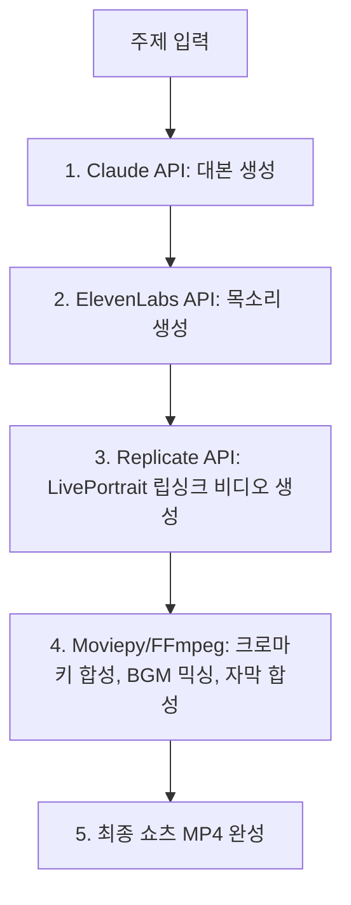

# 🤖 AI 영상 제작 완전 자동화 및 효율 극대화 전략 (공학적 접근)

기존 파이프라인(대본 ➡️ 이미지 ➡️ 음성 ➡️ 립싱크 ➡️ 자막/BGM ➡️ 편집)은 퀄리티가 우수하지만, 수작업(다운로드, 크로마키 제거, 타임라인 정렬 등)이 많이 개입됩니다. 

품질은 그대로 유지(혹은 향상)하면서 제작 시간을 **90% 이상 단축할 수 있는 AI 자동화 고도화 전략** 3가지를 제시합니다.

---

## 전략 1: 파이썬 API 기반 완전 자동화 파이프라인 (추천 - 제로 노가다)

개발 및 코딩을 조금 접목하여 **"주제 입력 ➡️ 최종 MP4 영상 완성"**까지 클릭 한 번으로 끝내는 자체 자동화 프로그램을 구축하는 방법입니다.

### 🛠️ 자동화 기술 스택 및 연동 방식
1. **대본 자동화 (Claude API)**: 파이썬 스크립트에서 Claude API를 호출해 한글 교육 대본을 규격화된 JSON 형태로 가져옵니다. (캐릭터별 대사 자동 분리)
2. **음성 생성 자동화 (ElevenLabs API)**: 분리된 대사 데이터를 ElevenLabs API로 전송하여 성우별 음성 파일(mp3)을 자동으로 내려받습니다.
3. **립싱크 비디오 자동화 (Replicate API - LivePortrait)**:
   * 이미지 생성은 초기에 미드저니로 캐릭터 표정 템플릿(정면, 기쁨, 슬픔 등) 5~6장만 확보해 둡니다.
   * 파이썬이 Replicate 클라우드 API를 호출하여 `마스터 이미지` + `생성된 mp3`를 전송하고 말하는 캐릭터 비디오를 자동으로 생성 및 다운로드합니다.
4. **최종 자동 합성 (Python MoviePy / FFmpeg)**:
   * 파이썬의 비디오 편집 라이브러리인 **MoviePy**를 이용해 자동으로 배경 이미지 위에 캐릭터 크로마키를 날려 합성합니다.
   * 오디오 트랙을 얹고 BGM 볼륨 조절(더킹)을 코드로 자동 연산하여 믹싱합니다.
   * Whisper API를 통해 받아온 자막 텍스트(SRT)를 영상에 강제로 입힙니다(Burn-in).

> [!TIP]
> 이 API 자동화 파이프라인을 구축해 두면, 엑셀 시트에 주제만 10개 써놓고 실행 버튼을 누르면 10개의 고화질 쇼츠 영상이 폴더에 한 번에 생성됩니다.

---

## 전략 2: 플랫폼 연동형 자동화 (Vrew / CapCut 최적화)

코딩 없이 기존 숏폼 제작 플랫폼의 자동화 기능을 결합하여 시간을 단축하는 방법입니다.

### 1. Vrew의 '텍스트로 비디오 만들기' 기능 극대화
Vrew는 텍스트만 넣으면 AI 목소리, 자막, 배경 이미지/비디오를 한 번에 자동 매칭하여 가편집본을 30초 만에 만들어 줍니다.
* **자동화 워크플로우**: Claude가 짜준 대본 입력 ➡️ Vrew에서 음성 및 자막 자동 생성 ➡️ 어색한 배경 이미지 부분만 내 미드저니 캐릭터 이미지로 드래그 앤 드롭 교체 ➡️ 완성.
* **효과**: 타임라인 조절과 자막 싱크 맞추는 시간이 0초로 단축됩니다.

### 2. 캡컷(CapCut)의 '스마트 템플릿' 및 '배치 내보내기'
* 자주 사용하는 3명 캐릭터의 화면 분할 구도, 자막 스타일, BGM 볼륨 오디오 더킹 강도를 **'프로젝트 템플릿'**으로 미리 저장해 둡니다.
* 새로운 영상 제작 시, 오디오 파일과 립싱크 비디오 파일만 기존 클립 위에 **'대체하기(Replace)'**로 덮어씌우면 모든 효과와 카메라 워킹이 그대로 유지된 채 5분 만에 완성됩니다.

---

## 전략 3: 롱폼 ➡️ 숏폼 변환 AI 자동화 (원소스 멀티유즈)

한국어 교육 내용을 10분짜리 롱폼 영상(유튜브 강의)으로 한 편 만든 뒤, AI가 조회수가 잘 나올 만한 핵심 구간만 잘라내어 쇼츠 10~20개로 자동 가공해 주는 방식입니다.

* **추천 AI 툴**: **Opus Clip** / **Munch** / **Dumme**
* **자동화 원리**:
  1. 10분짜리 가로형 원본 동영상을 업로드합니다.
  2. AI가 자동으로 재미있거나 유익한 구간을 탐지해 9:16 세로형으로 화면을 리프레임(Reframe)합니다.
  3. 말하는 화자의 얼굴을 트래킹하여 카메라 앵글을 유지합니다.
  4. 화려한 숏폼 스타일의 이모지 자동 첨부 자막을 입혀서 즉석 다운로드 링크를 제공합니다.
* **효과**: 롱폼 영상 한 편을 찍으면 일주일 치 쇼츠 콘텐츠 기획 및 제작 리소스가 99% 자동 해결됩니다.
