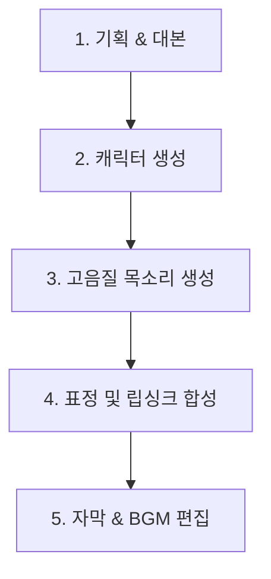
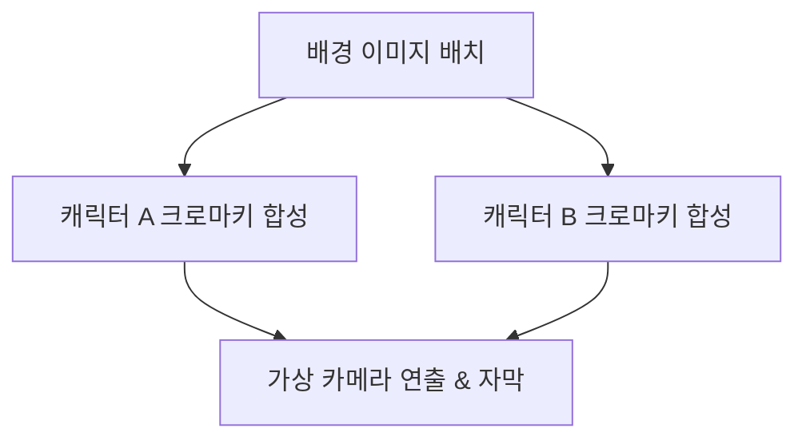
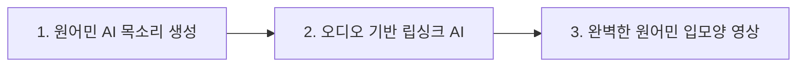

# 🎬 AI 한국어 교육 쇼츠 제작 파이프라인 (최종본)

AI 캐릭터 3명을 활용하여 자연스럽고 몰입감 있는 한국어 교육 유튜브 쇼츠를 제작하기 위한 최적의 파이프라인과 툴 조합입니다. AI 특유의 어색함(불쾌한 골짜기)을 지우고 시청자의 이탈을 막는 것을 최우선 목표로 설계되었습니다.

---

## 📌 핵심 요약: 이질감을 없애는 3대 원칙
1. **일관성 있는 캐릭터 비주얼**: 영상마다 캐릭터의 얼굴이 바뀌는 현상을 완벽히 통제해야 합니다.
2. **자연스러운 미세 표정**: 입만 움직이는 뻐끔거리는 애니메이션 대신, 눈 깜빡임과 고개 흔들림이 동반되는 **LivePortrait** 계열 기술을 사용합니다.
3. **감정이 실린 음성**: 국어책 읽는 TTS가 아닌, 호흡과 억양이 살아있는 감정 조절 TTS를 사용합니다.

---

## 🔄 단계별 제작 파이프라인 및 추천 툴

### 1단계: 대본 및 콘텐츠 기획 (Claude 3.5 Sonnet)
한국어 교육 쇼츠는 상황극이나 3명의 대화 티키타카가 핵심입니다. 자연스러운 한국어 구어체와 트렌디한 표현을 짜는 데 가장 우수한 성능을 보이는 LLM을 선택합니다.
*   **추천 툴**: **Claude 3.5 Sonnet** (ChatGPT보다 한국어 뉘앙스, 유머, 구어체 표현에서 훨씬 자연스러운 결과물을 냅니다.)
*   **작업 방식**: 3명의 캐릭터 페르소나(예: K-pop 팬 외국인, 깐깐한 한국인 선생님, 트렌디한 대학생)를 명확히 정의하고 대화 형식의 스크립트 작성 요청.

### 2단계: 캐릭터 비주얼 생성 (Midjourney)
3명의 캐릭터가 매번 같은 얼굴을 유지해야 몰입감이 생깁니다.
*   **추천 툴**: **Midjourney (v6)**
*   **핵심 기능**: `--cref` (Character Reference) 파라미터 활용
*   **작업 방식**:
    1. 각 캐릭터의 마스터 이미지(정면, 깔끔한 배경, 좋은 광원)를 먼저 한 장씩 생성합니다.
    2. 이후 새로운 표정이나 구도의 이미지를 만들 때 마스터 이미지의 링크를 복사하여 `--cref [이미지URL]` 형식으로 일관성을 유지합니다.
    > [!TIP]
    > 캐릭터의 옷 스타일도 일관되게 고정하기 위해 `--cof` (Character Outfit)나 프롬프트에 의상을 고정하여 묘사하는 것이 좋습니다.

### 3단계: 자연스러운 음성 생성 (ElevenLabs / Typecast)
아무리 화면이 예뻐도 목소리가 기계 같으면 시청자는 즉시 이탈합니다.
*   **추천 툴**:
    *   **Typecast (타입캐스트)**: 한국어 서비스로서 다양한 감정(화남, 슬픔, 기쁨 등)과 자연스러운 한국어 억양 필터가 가장 우수합니다. 3명의 목소리를 각기 다르게 배정하기 매우 편리합니다.
    *   **ElevenLabs**: 글로벌 최고 수준의 TTS 퀄리티를 제공합니다. 커스텀 보이스 클로닝 성능이 뛰어나 독창적인 목소리를 만들고 싶을 때 추천합니다.
*   **작업 방식**: 대본의 감정선에 맞춰 속도(Speed)와 감정 피치(Pitch)를 미세 조절하여 다운로드합니다.

### 4단계: 표정 및 립싱크 애니메이션 (LivePortrait / HeyGen)
사진에 생명을 불어넣어 실제로 말하는 것처럼 만드는 단계로, 이질감이 가장 많이 발생하는 구간입니다.
*   **추천 툴**:
    *   **LivePortrait (가장 추천 - 오픈소스 기반 서비스 이용 가능)**: 기존의 단순 립싱크 툴(SadTalker 등)과 달리, 실제 사람이 말하는 가이드 영상의 미세한 눈 움직임, 눈썹 찌푸림, 고개 돌림 등의 표정 변화(Motion)를 AI 캐릭터 이미지에 그대로 복사(Target)해 줍니다. 
    *   **HeyGen (헤이젠)**: 기업형 템플릿과 고품질 비디오 아바타 제작에 적합하며, 웹에서 간편하게 고화질 립싱크 비디오를 뽑아내기 좋습니다.
*   **작업 방식**: 본인이 직접 카메라를 보고 대사를 녹음하면서 표정 연기를 한 가이드 영상을 찍은 뒤, **LivePortrait**를 통해 AI 캐릭터 이미지에 모션을 이식합니다. 이 방법이 현재 가장 이질감이 없는 최선책입니다.

### 5단계: 자막 및 오디오(BGM/SFX) 전문화 단계 (CapCut / Vrew / Soundraw)
쇼츠의 시청 유지율(Retention)을 결정짓는 핵심 단계입니다. AI 전문가들은 자막과 음향을 단순 보조 도구가 아닌, 몰입감을 극대화하는 '액션 요소'로 활용합니다.

#### 💬 1. 자막(Subtitles) 처리: '가독성'과 '동적 효과' 극대화
AI 전문가들은 단순히 글자만 띄우지 않고 시각적 피로도를 낮추는 동적 자막을 씁니다.
*   **추천 툴**:
    *   **CapCut (캡컷)**: 숏폼 트렌드에 최적화된 **'동적 자막(Dynamic Captions)'** 템플릿이 매우 강력합니다. 말하는 속도에 맞춰 글자가 튀어나오거나 빛나는 효과(가라오케 스타일)를 터치 한 번으로 적용할 수 있습니다.
    *   **Vrew (브루)**: 한국어 음성 인식률(STT)이 독보적이며, 단어 단위로 텍스트 색상을 다르게 하거나 연관된 **이모지(Emoji)를 자동으로 삽입**해 주는 기능이 있어 한국어 교육 쇼츠에 매우 유용합니다.
*   **AI 전문가들의 자막 팁**:
    *   **강조 색상 법칙**: 전체 자막은 흰색으로 유지하되, 핵심 키워드(예: 교육 대상 단어)는 **노란색(#FFD700)**이나 **형광 연두색(#39FF14)**으로 강조합니다.
    *   **안전 영역(Safe Zone) 준수**: 유튜브 쇼츠의 하단 타이틀 영역과 우측 반응 버튼(좋아요, 댓글)에 자막이 가려지지 않도록 화면 중앙에서 약간 아래(중하단 35~40% 영역)에 자막을 배치합니다.

#### 🎵 2. 배경음악(BGM) & 효과음(SFX) 처리: '오디오 더킹'과 '커스텀 음원'
단조로운 AI 목소리의 한계를 배경 오디오 디자인으로 보완합니다.
*   **추천 툴**:
    *   **Soundraw (사운드로우)**: 영상의 분위기(예: Cute, Upbeat, Lo-Fi), 템포, 악기 구성을 직접 선택하고 길이에 맞춰 AI가 저작권 없는 곡을 즉석에서 짜줍니다. 곡의 빌드업과 잔잔한 구간을 마우스 드래그로 조절 가능하여 편집 효율이 극도로 높습니다.
    *   **Suno AI / Udio**: 채널의 시그니처 오프닝/엔딩 로고송을 15초짜리 중독성 있는 K-Pop 스타일로 만들 때 사용합니다.
*   **AI 전문가들의 오디오 팁**:
    *   **오디오 더킹(Audio Ducking) 필수**: 캐릭터가 말할 때는 BGM 볼륨이 자동으로 -15dB~-20dB만큼 작아지고, 대화가 멈추는 구간에서는 다시 BGM이 커지도록 설정합니다. CapCut이나 프리미어 프로의 'Ducking' 기능을 켜면 자동 설정됩니다.
    *   **반응형 SFX 매칭**: 중요 자막이 팝업되거나 캐릭터가 놀라는 리액션을 할 때 **'Pop'**, **'Swoosh'**, **'Ding'** 등의 효과음을 미세하게 넣어주어 기계적인 느낌을 지우고 뇌에 자극을 줍니다.

---

## 💡 AI 이질감을 지우는 디테일 연출 팁 (Secret Tips)

1. **사운드 이펙트(SFX)와 배경음악(BGM) 활용**:
   * AI 음성은 다소 건조하게 느껴질 수 있습니다. 잔잔한 배경음악을 깔고, 캐릭터 리액션 시 효과음(뿅, 띠용 등)을 적극적으로 넣어 기계적인 느낌을 묻어버리세요.
2. **가상 카메라 무빙 주입**:
   * AI 비디오는 카메라 워킹이 없어서 답답해 보입니다. 편집 프로그램(CapCut 등)에서 키프레임을 주어 카메라가 캐릭터 쪽으로 서서히 다가가거나(Zoom-in) 옆으로 이동하는(Pan) 효과를 인위적으로 주면 라이브 카메라로 촬영한 느낌을 줄 수 있습니다.
3. **적절한 컷 편집 주기**:
   * 한 캐릭터가 3초 이상 멈춰서 말하게 하지 마세요. 화면 구도를 바꾸거나, 말하는 중간에 교육용 단어 그래픽 카드를 화면에 띄우는 등 시각적 환기를 지속적으로 주어야 시청자가 AI 캐릭터의 미세한 어색함을 눈치채지 못합니다.

---

## 🎥 실전 영상 생성 및 합성 가이드 (부끼쇼 스타일 구현)

유튜브 채널 '부끼쇼(vkki show)'처럼 2D 캐릭터 상황극 기반의 한국어 교육 쇼츠 영상을 실제로 제작할 때, 음성 생성(3단계) 이후 **영상을 움직이게 만들고 최종 합성하는 구체적인 워크플로우**입니다.

### 1단계: 캐릭터 애니메이션 만들기 (움직임 부여)
정지된 캐릭터 이미지에 생명(말하기, 눈 깜빡임, 고개 움직임)을 불어넣는 단계입니다.

*   **방법 A: LivePortrait (전문가 강추 - 이질감 최소화)**
    *   **원리**: 캐릭터 정지 이미지와 **실제 본인이 말하는 가이드 영상**을 입력하면, AI가 내 표정과 입모양, 고개 흔들림을 그대로 캐릭터에 이식합니다.
    *   **베스트 툴**: **LivePortrait** (오픈소스 또는 웹 서비스 버전)
    *   **장점**: TTS 음성에 단순 입만 맞추는 툴보다 백배 자연스러운 리액션과 표정 연출이 가능합니다.
*   **방법 B: HeyGen / D-ID (가장 빠르고 간편함)**
    *   **원리**: 캐릭터 정지 이미지와 3단계에서 만든 TTS 음성 파일을 업로드하면 AI가 음성에 맞춰 입을 맞춰줍니다.
    *   **베스트 툴**: **HeyGen (헤이젠)**
    *   **장점**: 사용법이 직관적이며 음성 파일만 올리면 자동으로 말하는 캐릭터 영상이 뚝딱 나옵니다.
    > [!IMPORTANT]
    > 캐릭터 애니메이션 비디오를 추출할 때, 배경을 단색 그린스크린(Green Screen)으로 설정하고 다운로드해야 최종 편집기에서 배경을 지우고 합성하기 편리합니다.

---

### 2단계: 캡컷(CapCut)에서 최종 합성 및 레이아웃 배치
각각 만든 캐릭터 영상들과 배경을 합쳐 최종 쇼츠를 만듭니다.

1.  **배경 설정 (9:16 비율)**:
    *   **CapCut**을 켜고 프로젝트 비율을 9:16(쇼츠 규격)으로 설정합니다.
    *   Midjourney 등에서 생성한 교실, 카페, 야외 등 한국어 학습 상황에 맞는 고품질 배경 이미지를 트랙 아래쪽에 깝니다.
2.  **크로마키(Chroma Key) 합성**:
    *   그린스크린 배경으로 추출한 캐릭터 영상들을 오버레이(PIP) 트랙에 올립니다.
    *   CapCut의 **'오려내기 > 크로마키'** 기능을 선택해 초록색 배경을 지워주면, 캐릭터만 배경 위에 깔끔하게 얹어집니다.
3.  **가상 카메라 연출 (이질감 제거 핵심)**:
    *   **상황극 구도 잡기**: 대화 흐름에 따라 캐릭터들을 좌/우/중앙에 배치합니다.
    *   **화자 전환 컷(Cut) 편집**: 대사 트랙에 맞춰 말하는 캐릭터 쪽으로 화면을 확대(Zoom-in)하거나 전환합니다. 카메라 구도를 고정해 두면 AI 특유의 정적인 느낌 때문에 매우 어색해지므로, 2~3초마다 구도를 쪼개어 연출해야 합니다.

---

## ❓ 자주 묻는 질문 (Q&A): 왜 프롬프트로 한 번에 영상을 뽑지 않나요?

**Q. 미드저니 캐릭터 이미지를 넣고 대사 프롬프트만 입력하면 통째로 영상을 만들어주는 툴은 없나요?**

**A. 결론부터 말씀드리면, "기술적으로 가능하지만, 교육용 콘텐츠로 쓰기에는 아직 매우 부자연스럽고 부적합합니다."**

이유는 크게 두 가지입니다:

1. **캐릭터 일관성 붕괴 (Character Drift)**: Runway Gen-3나 Luma 같은 순수 텍스트-투-비디오(Text-to-Video) AI에게 대사를 프롬프트로 주면, 매 프레임마다 얼굴의 픽셀을 새로 그리기 때문에 말이 진행될수록 얼굴 뼈대가 무너지거나 옷 색상이 바뀌고, 안경이 사라지는 등의 왜곡(일관성 깨짐)이 발생합니다.
2. **부정확한 입모양 (Lip-Sync 불일치)**: 순수 비디오 AI는 대사의 발음 기호(음소)와 입술 움직임을 정교하게 동기화하지 못합니다. 그냥 '입을 움직이는 사람 비디오'를 대강 그리기 때문에 한국어 발음과 입모양이 매칭되지 않습니다.

**영어권 학습자를 위한 한국어 교육** 콘텐츠에서는 정확한 발음의 입모양(ㅏ, ㅓ, ㅡ 등)과 신뢰감 있는 비주얼이 생명입니다. 

따라서 AI 전문가들은 다음과 같은 **'하이브리드 워크플로우'**를 사용합니다:
*   **미드저니**: 캐릭터 얼굴(고화질 정지 이미지) 고정
*   **오디오 AI (ElevenLabs / Typecast)**: 명확하고 정확한 발음의 한국어 음성 생성
*   **립싱크 AI (HeyGen / LivePortrait / Kling 3.0)**: 고정된 캐릭터 이미지에 음성을 얹어 **얼굴 이목구비는 그대로 유지하고 입 주변과 얼굴 근육만 정밀하게 움직이도록 렌더링**

이 방식을 사용해야만 시청자가 불쾌한 골짜기를 느끼지 않고 자연스럽게 한국어 발음과 수업 내용에 집중할 수 있습니다.

---

## ❓ 자주 묻는 질문 (Q&A): 한국인 제작자의 영어 입모양/발음 문제 해결법

**Q. 저는 한국인이라 영어 발음이나 입모양이 원어민 같지 않은데, 제 얼굴을 촬영해서 캐릭터에 이식하는 방식(LivePortrait)은 무리가 있지 않을까요?**

**A. 네, 아주 정확하고 날카로운 지적입니다. 영어를 사용해 한국어를 가르칠 때는 더욱 그렇습니다. 이 경우, 얼굴 촬영 대신 "오디오 구동형 AI (Audio-to-Video)"를 사용하는 것이 정답입니다.**

실제 내 얼굴을 찍어서 모션을 이식하는 방식은 비원어민 특유의 입모양 한계(F, V, Th, R, L 발음 시 입술 모양 차이)가 그대로 전달될 수 있고, 매번 촬영해야 하는 번거로움이 있습니다. 

따라서 이 문제를 완벽히 해결하는 최적의 우회 워크플로우를 제안합니다.

### 💡 100% 원어민 입모양 구현을 위한 우회 워크플로우

1. **완벽한 원어민 음성 준비 (TTS)**:
   * **영어 설명**: **ElevenLabs**에서 자연스러운 미국/영국 네이티브 AI 목소리를 생성합니다.
   * **한국어 발음**: **Typecast**에서 표준 발음의 네이티브 한국어 목소리를 생성합니다.
2. **오디오 구동형 립싱크 AI 활용 (HeyGen / Hedra / Kling 3.0)**:
   * 본인의 얼굴 비디오 대신, 위에서 만든 **원어민 음성 파일(mp3)만** AI 립싱크 툴에 입력합니다.
   * **HeyGen**이나 **Hedra** 같은 오디오 기반 AI는 오디오의 발음 기호(음소)를 인지하여 **해당 언어의 완벽한 원어민 입모양(F, V, Th 발음 시 입술이 치아를 누르는 모양 등)**을 자동으로 계산해 렌더링해 줍니다.

### 🌟 이 방식의 장점
* **신뢰감 상승**: 영어 설명 파트에서는 완벽한 미국/영국인 입모양이, 한국어 예시 파트에서는 완벽한 한국어 입모양이 자동으로 구현되어 교육 콘텐츠로서의 신뢰감이 극대화됩니다.
* **노동력 차단**: 직접 카메라 앞에서 어색하게 입을 맞추며 연기하고 녹화하는 번거로운 과정이 완전히 사라집니다. 프롬프트와 오디오 조작만으로 방 안에서 전 세계 대상 교육 콘텐츠를 완성할 수 있습니다.

---

## 🎬 바이트댄스 씨댄스 (Seedance / Dreamina) 분석 및 활용법

바이트댄스(ByteDance)가 개발한 비디오 AI 모델인 **씨댄스(Seedance, 주로 Dreamina 플랫폼을 통해 서비스됨)**는 현재 매우 뛰어난 비디오 생성 툴 중 하나입니다. 결코 나쁜 툴이 아니며, 오히려 **액션 및 물리 효과 연출에 최상위급 성능**을 자랑합니다.

다만, 본 프로젝트(캐릭터 3명의 한국어 교육 쇼츠)의 목적에 맞춰 장단점을 분리해 전략적으로 활용해야 합니다.

### 1. 씨댄스(Seedance)의 강력한 장점 (이럴 때 쓰세요!)
*   **동적인 액션(B-Roll) 생성**: 캐릭터가 단순히 서서 말하는 것 외에, "서울 거리를 걷는 모습", "한국 음식을 먹는 모습", "칠판에 글씨를 쓰는 모습" 등 **역동적인 동작 장면**을 만들 때 완벽합니다. 미드저니 캐릭터 이미지를 입력(Image-to-Video)하고 동작 프롬프트를 주면 물리학적으로 아주 자연스러운 3~4초짜리 행동 영상이 나옵니다.
*   **멀티샷 연출**: 여러 각도의 카메라 무빙(패닝, 줌인 등)을 시뮬레이션하는 데 우수합니다.

### 2. 씨댄스의 한계점 (대화 장면에 비추천하는 이유)
*   일반적인 비디오 생성 AI의 공통 한계로, 10초가 넘어가는 긴 설명 대사(한국어 음성)를 정교한 입모양으로 매칭하여 싱크를 맞추는 능력이 **HeyGen**이나 **LivePortrait** 같은 전문 립싱크 툴에 비해 다소 떨어집니다. 대사 중간에 얼굴이 미세하게 찌그러지거나 일관성이 깨질 위험이 있습니다.

### 💡 베스트 추천 워크플로우 (하이브리드 전략)
부끼쇼 수준의 퀄리티를 내려면 두 툴의 장점만 섞는 것이 정답입니다.

1.  **말하는 강의 세션 (메인 영상)**: **LivePortrait** 또는 **HeyGen**을 사용하여 얼굴 고정 및 한국어 발음 입모양 일치에 집중합니다.
2.  **중간 상황극/동작 세션 (B-Roll 영상)**: 캐릭터 이미지와 장소를 **Seedance (Dreamina)**에 넣고 "캐릭터 A가 당황하며 손사래를 치는 모습" 등을 비디오로 생성하여 중간중간 삽입합니다.

이 방식을 쓰면 정적인 교육 영상에 생동감 넘치는 애니메이션 효과가 더해져 쇼츠 시청 유지율(Retention)을 폭발적으로 올릴 수 있습니다.

---

## 💰 툴별 추천 안 및 월간 예산 설계 (2026년 기준)

어떤 워크플로우를 선택하느냐(직접 얼굴 녹화 vs AI 오디오 기반 자동 생성)에 따라 4단계 추천 툴이 달라지며, 예산 규모도 조정할 수 있습니다.

### 1. 4단계(영상 생성) 선택 가이드
*   **본인 얼굴로 표정 연기를 정교하게 하겠다**: **LivePortrait** (추천)
    *   *비용*: 개인 PC에 고성능 GPU(RTX 3060 이상)가 있다면 **$0 (무료)**, 클라우드 API(Replicate 등) 이용 시 영상당 약 $0.05로 매우 저렴.
*   **얼굴 노출/녹화 없이 100% 원어민 입모양 오디오로 자동 제작하겠다**: **HeyGen** 또는 **Hedra** (추천)
    *   *비용*: **Hedra**는 무료~월 $10 선, **HeyGen**은 월 약 $29 (Creator 플랜) 수준으로 가장 고품질의 립싱크 제공.

---

### 2. 추천 툴 요약 및 요금제 비교

| 파이프라인 단계 | 추천 툴 | 추천 요금제 종류 | 대략적 비용 (월) | 비고 |
| :--- | :--- | :--- | :--- | :--- |
| **1단계: 기획/대본** | Claude 3.5 Sonnet | Free Tier 또는 Claude Pro | $0 ~ $20 | 초반에는 무료 버전으로 시작 가능 |
| **2단계: 캐릭터** | Midjourney | Basic Plan | $10 ~ $30 | 캐릭터 일관성을 위해 유료 필수 |
| **3단계: 음성 (TTS)** | ElevenLabs + Typecast | Starter (Eleven) + Light (Typecast) | 약 $14 ($5 + $9) | 영어/한국어 최상의 목소리 조합 |
| **4단계: 영상 립싱크** | HeyGen 또는 Hedra | Creator Plan / Basic Plan | $10 ~ $29 | 오디오 기반 자동 원어민 입모양 연출 |
| **5단계: BGM** | Soundraw | Creator Plan | $0 ~ $17 | 캡컷 기본 무료 BGM 사용 시 $0 가능 |
| **5단계: 최종 편집** | CapCut + Vrew | Free Tier 또는 Vrew Light | $0 ~ $7 | 자동 자막 노가다 단축용 |

---

### 3. 월간 예산 가이드라인 (2가지 시나리오)

#### 📉 시나리오 A: 가성비 시작 세팅 (월 약 $34 ~ $51 / 한화 5~7만 원 선)
처음 시작하는 단계에서 리스크를 최소화하고 필수적인 유료 툴만 구독하는 조합입니다.
*   **대본**: Claude 3.5 무료 버전 ($0)
*   **캐릭터**: Midjourney Basic ($10)
*   **음성**: ElevenLabs Starter ($5) + Typecast Light ($9)
*   **립싱크**: Hedra 기본 플랜 ($10) 또는 LivePortrait 로컬 GPU ($0)
*   **BGM/편집**: CapCut 무료 배경음 및 무료 버전 ($0)
*   **자막**: Vrew 무료 제공 범위 내 사용 ($0)

#### 🚀 시나리오 B: 프로 채널 양산 세팅 (월 약 $90 ~ $110 / 한화 12~15만 원 선)
작업 시간을 단축하고 고품질 쇼츠를 주기적으로 업로드(주 3회 이상)하기 위한 가장 효율적인 전문가 세팅입니다.
*   **대본**: Claude Pro ($20) - 대량 대본 작성 시 막힘 없음
*   **캐릭터**: Midjourney Standard ($30) - 제한 없는 이미지 무한 생성 가능
*   **음성**: ElevenLabs Creator ($22) + Typecast Premium/Light ($9)
*   **립싱크**: HeyGen Creator ($29) - 15분 분량(쇼츠 약 20편 제작 가능)
*   **BGM**: Soundraw Creator ($17) - 맞춤형 음악 무제한 다운로드
*   **편집/자막**: Vrew Light ($7) - 빠른 자동 한국어/영어 동적 자막 스타일링
